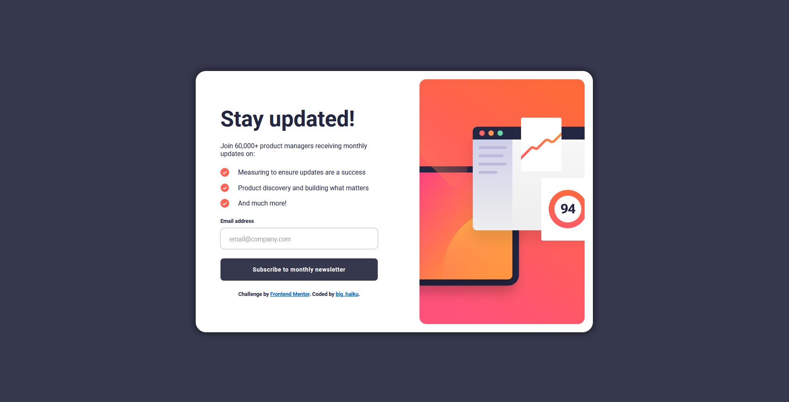
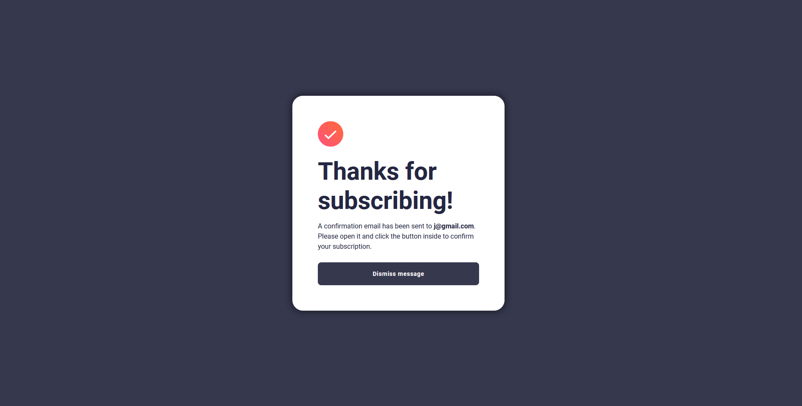
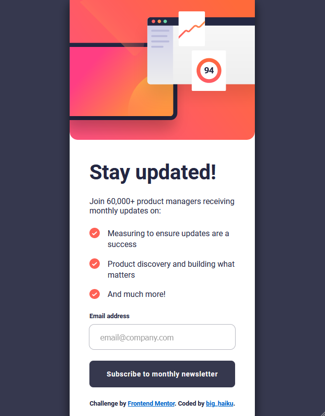

# Frontend Mentor - Newsletter sign-up form with success message solution

This is a solution to the [Newsletter sign-up form with success message challenge on Frontend Mentor](https://www.frontendmentor.io/challenges/newsletter-signup-form-with-success-message-3FC1AZbNrv). Frontend Mentor challenges help you improve your coding skills by building realistic projects.

## Table of contents

- [Overview](#overview)
  - [The challenge](#the-challenge)
  - [Screenshot](#screenshot)
  - [Links](#links)
- [My process](#my-process)
  - [Built with](#built-with)
  - [What I learned](#what-i-learned)
  - [Continued development](#continued-development)
- [Author](#author)
- [Acknowledgments](#acknowledgments)

## Overview

### The challenge

Users should be able to:

- Add their email and submit the form
- See a success message with their email after successfully submitting the form
- See form validation messages if:
  - The field is left empty
  - The email address is not formatted correctly
- View the optimal layout for the interface depending on their device's screen size
- See hover and focus states for all interactive elements on the page

### Screenshot





### Links

- Solution URL: [Add solution URL here](https://your-solution-url.com)
- Live Site URL: [Add live site URL here](https://your-live-site-url.com)

## My process

### Built with

- Semantic HTML5 markup
- CSS custom properties
- Flexbox
- CSS Grid
- JS

### What I learned

I learned a lot about JavaScript from this project. I am still quite new to it and a lot fo time was spent trying to iron out any kinks in the code to make it work. While it is functional and I'm happy with the work I did, especially being able to get regex working (I think), I'm sure that it can be improved substantially.

That being said, I'm happy with most of my CSS, particularly the effect added to the buttons when active.

Discovering the "draggable" attribute was also helpful for touching up a link styling as a button to make clicking it cleaner.

```html
<a draggable="false" class="purpleButton" href="index.html">Dismiss message</a>
```

```css
.purpleButton:active {
  background: linear-gradient(
    86deg,
    rgba(195, 34, 139, 1) 6%,
    rgba(253, 162, 45, 1) 100%
  );
}
.purpleButton:active:before {
  content: "";
  display: block;
  position: absolute;
  opacity: 0.4;
  inset: -5px; /* control the spread */
  transform: translate(0, 5px); /* control the offsets */
  z-index: -1;
  background: linear-gradient(
    86deg,
    rgba(195, 34, 139, 1) 6%,
    rgba(253, 162, 45, 1) 100%
  );
  filter: blur(10px); /* control the blur */
  -webkit-transition: background 1000ms linear;
  -ms-transition: background 1000ms linear;
  transition: background 1000ms linear;
}
```

```js
const emailRegex = /^[^\s@]+@[^\s@]+\.[^\s@]+$/;
const isValidEmail = emailRegex.test(emailInput.value);

if (!isValidEmail) {
  // Handle invalid email case
  invalidEmailLabel.style.display = "block";
  emailInput.style.outline = "1px solid var(--Tomato)";
  emailInput.style.color = "hsl(4, 100%, 67%)";

  return; // Stop further execution if email is invalid
}
```

### Continued development

I am not completely comfortable with my JavaScript basics yet and this project reinforced that. It took a lot of effort to get everything working as intended and I would like to learn more about reinforcing my form validation and making my code as clean and efficient as possible.

I also need more practice with "display: grid;"; for some reason my first and second lines of text within the grid were switched despite seemingly having correct ordering. Any advice anyone can give me on what went wrong would be a great help.

## Author

- Website - [big_haiku](https://www.your-site.com)

## Acknowledgments

Thanks to Frontend Mentor for the opportunity to complete this challenge.
